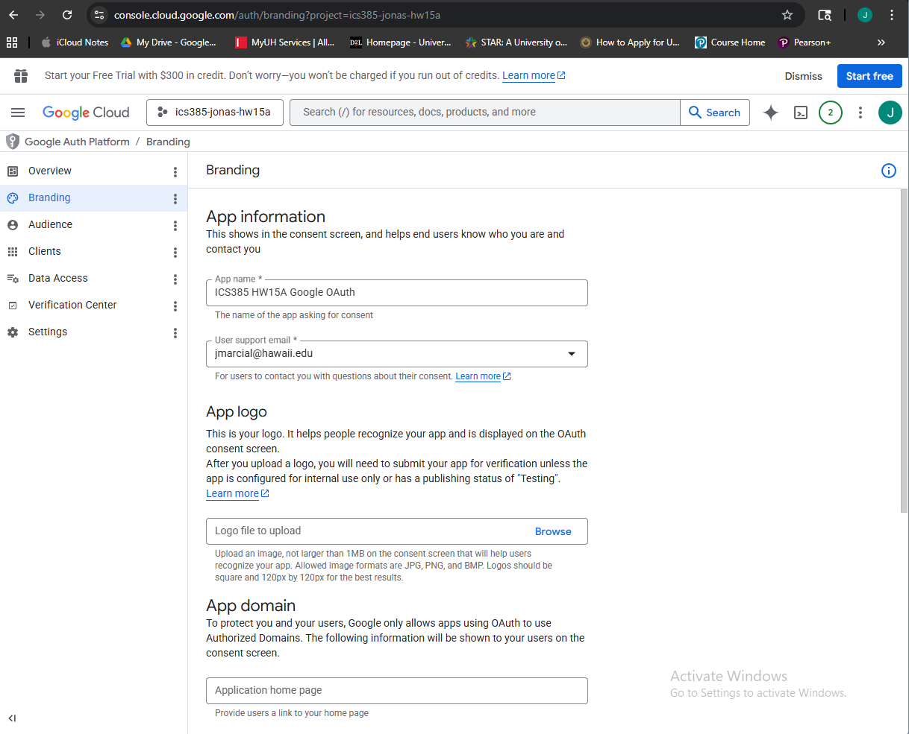
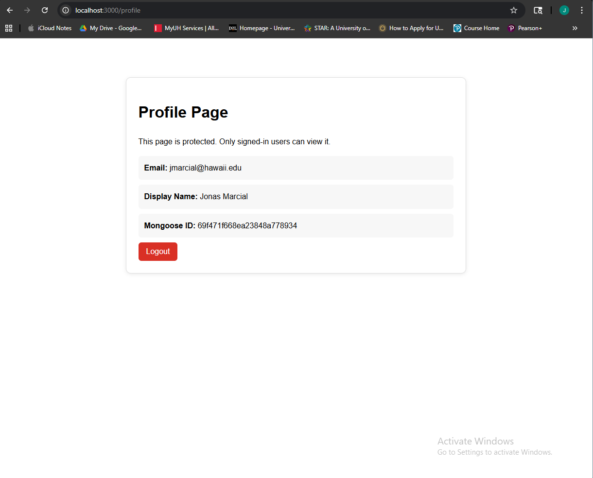
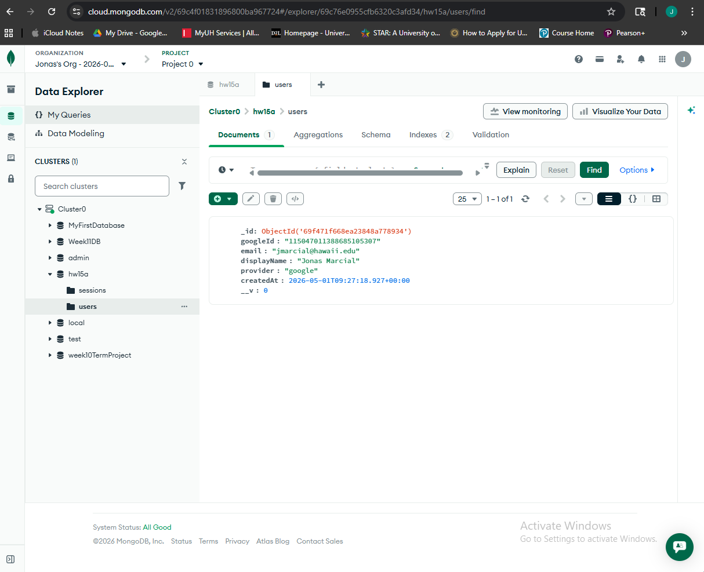

# HW15-A — Google OAuth 2.0

## Overview

This is a stand-alone Express application for ICS 385 HW15-A. It demonstrates Google OAuth 2.0 login using Passport.js, sessions, MongoDB, and EJS views.

Users can sign in with Google, and after login they are redirected to a protected profile page. The profile page displays the authenticated user's email, display name, and local Mongoose ID.

## Technologies Used

- Node.js
- Express
- EJS
- MongoDB Atlas
- Mongoose
- Passport.js
- passport-google-oauth20
- express-session
- connect-mongo
- dotenv

## Features

- Home page with a "Sign in with Google" button
- Google OAuth login flow
- Protected `/profile` route
- MongoDB user persistence
- Session storage using MongoDB
- Logout route
- Environment variables stored in `.env`
- `.env.example` included for setup reference
- `.env` excluded using `.gitignore`

## Screenshots

### Google OAuth App / Consent Branding

### Profile Page After Login

### MongoDB User Document

## Reflection

Google OAuth simplified authentication because my application did not need to create its own password system for users. Instead of storing and checking user passwords directly, the app lets Google handle identity verification and then stores the user’s Google profile information in MongoDB. This made the login experience faster and more familiar for users. However, it also added new responsibilities, such as protecting the Google Client Secret, setting the correct callback URL, managing sessions securely, and making sure the OAuth consent screen is configured correctly. Overall, OAuth made signing in easier, but it required careful setup between the app, Google Cloud Console, and MongoDB.

## AI Tools Used

I used ChatGPT as a coding assistant to help understand the assignment requirements, build the Express/Passport.js structure, troubleshoot setup errors, and write the README reflection. I reviewed the code and tested the application locally to make sure I understood how the OAuth routes, session middleware, MongoDB connection, and protected profile page worked.